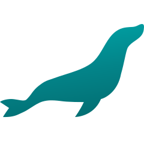

<h1 align="center">
    
</h1>

<h5 align="center">
  <code><a href="https://www.linkedin.com/in/karina-kock-ab272821a/" title="LinkedIn Profil"> LinkedIn</a></code>
  <code><a href="https://www.xing.com/profile/Karina_Kock077660/" title="Xing Profil"> Xing</a></code>
</h5>

 

<h2 align="center">Sprachen, Frameworks, Tools & Fähigkeiten</h2>
 

  
  <code></code>
  <code></code>
  <code></code>
  <code></code>
  <code></code>
  <code></code>
  <code></code>
  <code></code>
  <code></code>

<h2 align="center">Stats</h2>
 

  

    
    
  

       
  

    
  

       

  

<h2 align="center">Repos</h2>
 

  
  

   
